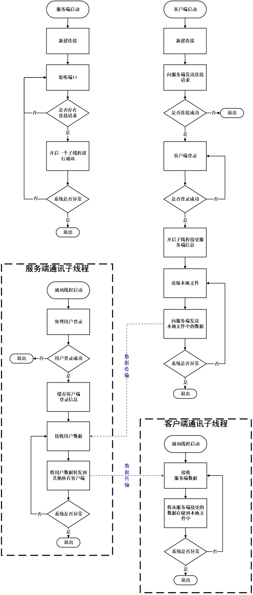

# 通讯流程

# 运行前准备
需求：\
- python3.8
- peewee: `pip install peewee`

# 服务端配置运行

1. 配置主机$IP$地址与端口 \
<<<<<<< HEAD
  在`config/server.py`中配置
=======
  在`./config/server.py`中配置
    - ip：目标服务器地址
    - port：目标服务器端口  
>>>>>>> 02e2a4ca27779c2074ef62845620490eaed9d42f
3. 在项目目录打开命令行，运行服务端 \
  `python server_start.py`
# 客户端配置运行
1. 配置服务端$IP$地址与端口 \
<<<<<<< HEAD
在`config/client.py`中配置
=======
在`./config/client.py`中配置
   - ip：目标服务器地址
   - port：目标服务器端口
>>>>>>> 02e2a4ca27779c2074ef62845620490eaed9d42f
2. 配置客户端名称 \
在`config/client.py`中配置
3. 在项目目录打开命令行，运行服务端 \
  `python client_start.py`

# 如何使用
本项目的目的是让用户在忘记通讯的时候实现通讯，将复杂的通讯流程简化为简单的文件读取操作，用户不需要关心通讯过程的具体实现

## 配置本地通讯客户端通讯信息
目前只支持**amr**客户端，在 \
在`./config/client.py`中配置
- e_type：设备类型
- e_number： 设备编号

## 向其他客户端发送数据
向`./storage/db/sqlite/dhblab_meta`数据库文件中对应与设备类型`e_type`表与表中对应`e_number`的行中写入需要发送的数据内容
## 同步其他客户端发送的数据
从`./storage/db/sqlite/dhblab_meta`数据库文件中读取数据内容
